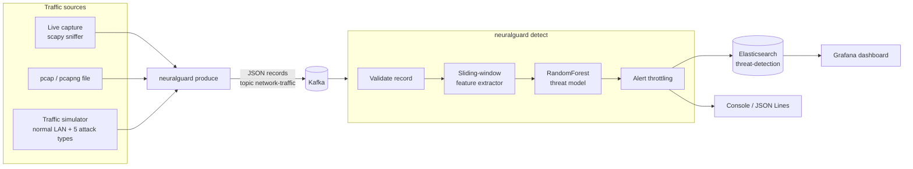

# NeuralGuard: AI-Powered Network Intrusion Detection

[](https://github.com/Adithya2357/NeuralGuard/actions/workflows/ci.yml)

[](LICENSE)

NeuralGuard watches network traffic in real time and flags attacks such as port scans,
stealth scans and SYN/UDP/ICMP floods. Packets are captured with **scapy**, streamed through
**Kafka**, scored by a **scikit-learn** model that looks at *behaviour over time* (not just
single packets), and every alert is indexed into **Elasticsearch** and charted in **Grafana**.

```text
$ neuralguard demo
True label    Packets  Flagged as threat  Correct attack type
------------  -------  -----------------  -------------------
normal           4232          35 (0.8%)                    -
port_scan         331       331 (100.0%)          330 (99.7%)
stealth_scan      574       574 (100.0%)         574 (100.0%)
syn_flood         424       424 (100.0%)         424 (100.0%)
udp_flood         263        239 (90.9%)         239 (100.0%)
icmp_flood        176       176 (100.0%)         176 (100.0%)

Detection rate (attack packets flagged):       98.6% (1744 of 1768)
False-positive rate (normal packets flagged):  0.8% (35 of 4232)
```

---

## Table of contents

- [How it works](#how-it-works)
- [Features](#features)
- [Quick start: no infrastructure (1 minute)](#quick-start-no-infrastructure-1-minute)
- [Full stack: Kafka + Elasticsearch + Grafana](#full-stack-kafka--elasticsearch--grafana)
- [Capturing real traffic](#capturing-real-traffic)
- [Detection in detail](#detection-in-detail)
- [Model performance](#model-performance)
- [Training on your own data](#training-on-your-own-data)
- [Configuration](#configuration)
- [Command reference](#command-reference)
- [Development](#development)
- [Security notes](#security-notes)
- [Upgrading from v0.1](#upgrading-from-v01)
- [Roadmap](#roadmap)
- [License](#license)

---

## How it works



1. **`neuralguard produce`** turns packets (live, from a pcap, or simulated) into small JSON
   *traffic records* and publishes them to Kafka, keyed by source IP.
2. **`neuralguard detect`** consumes the topic, validates each record, computes features over
   a sliding time window, and asks the model for a **threat score** (the probability that the
   packet is part of an attack) and the most likely **attack type**.
3. Threats become **alerts** with a severity. During a flood every packet is a threat, so
   alerts are throttled to one per (attack type, target) every few seconds. Each alert says
   how many duplicates it stands for.
4. Alerts go to the console, to Elasticsearch (explicit index mapping), and optionally to a
   JSON Lines file. The provisioned **Grafana** dashboard reads them from Elasticsearch.

## Features

- **Behavioural detection.** Per-source and per-destination sliding-window features
  (distinct ports and hosts contacted, SYN ratio, fan-in of distinct sources) make scans and
  floods visible, even though each individual scan packet looks innocent.
- **One feature pipeline for training and detection.** The trainer and the detector share
  the same record validation and feature extractor, and the model file stores its window
  length, so there is no train/serve skew.
- **Five attack classes plus normal traffic.** `port_scan`, `stealth_scan` (NULL/FIN/XMAS/ACK/
  Maimon), `syn_flood`, `udp_flood` (including DNS/NTP/SSDP/memcached reflection) and
  `icmp_flood`, each with a threat score, a predicted type and a severity
  (`low` / `medium` / `high` / `critical`).
- **Realistic traffic simulator.** It models an office LAN (web, DNS, NTP, SSH, NAS,
  streaming, video calls, pings, ARP, discovery protocols, monitoring) with randomised attack
  episodes. Normal traffic deliberately includes SYNs, pings and bursts, so "SYN = attack"
  cannot be learned. You can train and demo the whole system without root access or a live
  network.
- **Live capture and pcap replay.** IPv4/IPv6, TCP/UDP/ICMP/ICMPv6, ARP. The sniffer excludes
  NeuralGuard's own Kafka/Elasticsearch connections, so it never captures its own traffic.
- **Resilient service.** Retries while Kafka starts. Malformed messages are skipped and
  counted, never fatal. Elasticsearch outages are buffered with backoff and a bounded buffer.
  SIGINT/SIGTERM shut down gracefully, flushing pending alerts.
- **Production-minded packaging.** `pyproject.toml` with a `neuralguard` CLI, `NEURALGUARD_*`
  environment configuration, text or JSON logs, Docker image (non-root, model baked in
  read-only), `docker compose` stack bound to `127.0.0.1`, and GitHub Actions CI (ruff, tests
  on Python 3.10-3.13, bandit, pip-audit, Docker build).
- **Well tested.** 500+ unit and integration tests run in about 10 seconds, with no Kafka or
  Elasticsearch needed (fakes everywhere).

## Quick start: no infrastructure (1 minute)

Requires **Python 3.10+**.

```bash
git clone https://github.com/Adithya2357/NeuralGuard.git
cd NeuralGuard
python3 -m venv .venv && source .venv/bin/activate
pip install -e .

neuralguard demo        # trains a model in memory if none exists, then runs the demo
```

`demo` streams simulated traffic through the real detector in-process and prints the alerts
plus a table comparing detections with the ground truth (see the top of this page).

To train and save a model with a full evaluation report:

```bash
neuralguard train       # -> models/threat_model.joblib (+ .sha256), about 10 s
```

## Full stack: Kafka + Elasticsearch + Grafana

Requires Docker with Compose v2.

**Option A: everything in containers** (detector and simulator included):

```bash
docker compose --profile demo up --build      # or: make docker-demo
```

Open Grafana at <http://127.0.0.1:3000> (user `admin`, password `admin` unless you set
`GRAFANA_ADMIN_PASSWORD`). The **NeuralGuard - Threat Detection** dashboard is the home page
and fills up within a few seconds.

**Option B: infrastructure in containers, NeuralGuard on your machine:**

```bash
make up                        # Kafka (localhost:9092), Elasticsearch (:9200), Grafana (:3000)
neuralguard train              # once
neuralguard detect             # terminal 1: consume, detect, index alerts
neuralguard produce            # terminal 2: publish simulated traffic in real time
make down                      # stop (data volumes are kept)
```

The detector only needs to be started before the traffic. A consumer group with no committed
offset starts at the latest message. After a restart it resumes from where it left off.

The dashboard shows total and critical alerts, suppressed duplicates, alerts over time by
attack type, attack-type and severity breakdowns, the top source IPs, the threat-score trend
and a table of the latest alerts.

## Capturing real traffic

```bash
# Live capture (needs root or CAP_NET_RAW)
sudo .venv/bin/neuralguard produce --source live --interface eth0

# Replay a capture file
neuralguard produce --source pcap --pcap capture.pcapng

# Record records to a file instead of Kafka ('-' = stdout)
neuralguard produce --source pcap --pcap capture.pcap --output traffic.jsonl
```

By default the sniffer excludes the Kafka and Elasticsearch ports from your settings.
Otherwise every published record would generate more captured packets (a feedback loop).
`--bpf-filter 'tcp or udp'` sets a custom BPF filter (needs libpcap, e.g.
`apt install libpcap0.8`), and `--bpf-filter ''` captures everything.

> The bundled model is trained on **simulated** traffic. Expect false positives on a real
> network until you retrain on labelled captures from it (see
> [Training on your own data](#training-on-your-own-data)).

## Detection in detail

**Traffic record**: what the producer sends and the detector validates:

```json
{"timestamp": 1730647800.123, "source_ip": "203.0.113.5", "destination_ip": "192.168.1.20",
 "protocol": "TCP", "source_port": 40000, "destination_port": 22, "length": 60, "ttl": 64,
 "tcp_flags": "S"}
```

**Features**: 21 per packet, computed by one stateful extractor:

| Group | Features |
|---|---|
| Packet | protocol (TCP/UDP/ICMP/ARP one-hot), `length`, `ttl`, `source_port`, `destination_port`, `dst_port_well_known`, TCP flags SYN/ACK/FIN/RST/PSH/URG |
| Source window (last 10 s) | `src_packet_count`, `src_unique_dst_ports`, `src_unique_dst_ips`, `src_syn_ratio` |
| Destination window (last 10 s) | `dst_packet_count`, `dst_unique_src_ips` |

Window time is driven by packet timestamps, not the wall clock, so replays behave exactly
like live traffic. Memory is bounded even under spoofed-source floods (least recently seen
hosts are forgotten).

**Model**: a multiclass `RandomForestClassifier` (`normal` plus 5 attack types).
`threat_score = 1 - P(normal)`. A packet is a threat when the score reaches the threshold
(default `0.5`). Severity: `critical` >= 0.9, `high` >= 0.75, `medium` >= 0.6, else `low`.

**Alerts**: one per (attack type, destination IP) per cooldown (default 5 s, packet time).
`suppressed_count` carries the number of duplicates, and the remaining duplicates are
flushed as a summary when the flood ends or at shutdown, so `1 + suppressed_count` summed over
all alerts equals the number of threat packets.

**Model file**: a versioned joblib bundle with the feature names, window length, training
parameters and metrics, plus a `sha256sum`-style sidecar that is verified **before**
unpickling.

## Model performance

`neuralguard train` with defaults: 60,000 simulated packets for training, evaluated on a
**separate** 15,000-packet stream with a different seed, so the hosts, timings and attack
episodes are all unseen:

| Metric | Value |
|---|---|
| Detection rate (attack packets flagged) | 99.95% |
| False-positive rate (normal packets flagged) | 0.42% |
| ROC-AUC (threat vs normal) | 0.9998 |
| Attack-type accuracy (flagged attacks) | 100% |
| Per-class recall | port_scan 1.00, stealth_scan 1.00, syn_flood 0.998, udp_flood 1.00, icmp_flood 1.00 |
| Training time | about 7 s (4 cores) |

**Read these numbers honestly.** They are measured on synthetic traffic from the same
simulator family. They show the pipeline and the behavioural features work, not how the model
will do on your network. For real deployments, retrain on labelled captures from your
environment or a public dataset.

## Training on your own data

Write labelled records (one JSON object per line, schema above, plus a `label` of `normal`,
`port_scan`, `stealth_scan`, `syn_flood`, `udp_flood` or `icmp_flood`) and train on them:

```bash
neuralguard produce --source pcap --pcap benign.pcap --output benign.jsonl  # then add labels
neuralguard train --data labelled.jsonl --output models/my_model.joblib
```

Records are sorted by time, and the data is split **chronologically** (the last 25% is the
test set). A random split would leak, because neighbouring packets share almost identical
window features.

## Configuration

Every setting can be set with an environment variable. Command-line flags override them.

| Variable | Default | Meaning |
|---|---|---|
| `NEURALGUARD_KAFKA_BOOTSTRAP_SERVERS` | `localhost:9092` | comma-separated Kafka servers |
| `NEURALGUARD_KAFKA_TOPIC` | `network-traffic` | topic for traffic records |
| `NEURALGUARD_KAFKA_GROUP_ID` | `neuralguard-detector` | consumer group of the detector |
| `NEURALGUARD_ES_HOSTS` | `http://localhost:9200` | comma-separated Elasticsearch URLs |
| `NEURALGUARD_ES_INDEX` | `threat-detection` | alert index |
| `NEURALGUARD_ES_USERNAME` / `NEURALGUARD_ES_PASSWORD` | unset | basic auth |
| `NEURALGUARD_ES_API_KEY` | unset | API key auth (instead of basic auth) |
| `NEURALGUARD_ES_VERIFY_CERTS` | `true` | verify TLS certificates |
| `NEURALGUARD_ES_CA_CERTS` | unset | CA bundle for a private CA |
| `NEURALGUARD_MODEL_PATH` | `models/threat_model.joblib` | model file |
| `NEURALGUARD_THREAT_THRESHOLD` | `0.5` | threat-score threshold, in (0, 1] |
| `NEURALGUARD_WINDOW_SECONDS` | `10` | feature window used by `train` |
| `NEURALGUARD_ALERT_COOLDOWN_SECONDS` | `5` | alert throttling per (type, target); `0` disables |
| `NEURALGUARD_LOG_LEVEL` | `INFO` | `DEBUG` ... `CRITICAL` |
| `NEURALGUARD_LOG_FORMAT` | `text` | `text` or `json` (one object per line) |

Secrets are never logged or shown in `repr()`.

## Command reference

| Command | What it does | Useful options |
|---|---|---|
| `neuralguard train` | train, evaluate on held-out data, print a report, save the model | `--samples`, `--trees`, `--window`, `--data FILE.jsonl`, `--output`, `--report-json` |
| `neuralguard produce` | publish records to Kafka (or a JSON Lines file) | `--source simulate\|live\|pcap`, `--count`, `--seed`, `--attack-ratio`, `--no-pace`, `--interface`, `--bpf-filter`, `--pcap`, `--output` |
| `neuralguard detect` | consume, detect, alert | `--model`, `--threshold`, `--cooldown`, `--no-elasticsearch`, `--alerts-file`, `--max-messages` |
| `neuralguard demo` | the whole pipeline in-process, no infrastructure | `--count`, `--seed`, `--attack-ratio`, `--threshold`, `--model` |

Global options: `--log-level`, `--log-format text|json`, `--version`. Exit codes: `0` ok,
`1` service or I/O error, `2` bad input or configuration, `130` interrupted.
`python -m neuralguard` works too.

## Development

```bash
make venv && source .venv/bin/activate   # package + dev tools in .venv
make test        # pytest with coverage
make lint        # ruff
make security    # bandit + pip-audit
make help        # every target
```

CI (`.github/workflows/ci.yml`) runs lint, the test suite on Python 3.10-3.13, bandit and
pip-audit, and validates `docker-compose.yml` and the Docker image (build plus a smoke test).
Dependabot keeps pip packages, GitHub Actions and Docker images up to date.

```text
neuralguard/
  schema.py      traffic-record schema + validation (the single gate for every record)
  features.py    sliding-window feature extraction (shared by training and detection)
  simulator.py   synthetic labelled traffic: office LAN + attack episodes
  capture.py     scapy packet -> record, live capture, pcap reading
  producer.py    Kafka / JSON Lines record sinks, real-time pacing
  model.py       ThreatModel: training, prediction, evaluation, verified save/load
  train.py       datasets, held-out evaluation, training report
  detector.py    record -> features -> model -> Detection
  alerts.py      alert documents, throttling
  sinks.py       Elasticsearch (index mapping, bulk, backoff), console, JSON Lines
  consumer.py    Kafka detection service, graceful shutdown
  cli.py         the neuralguard command
deploy/grafana/  provisioned datasource + dashboard
tests/           unit and integration tests (no external services needed)
```

## Security notes

- **The compose stack is for local use.** Kafka and Elasticsearch run without
  authentication, and every port is published on `127.0.0.1` only. Before exposing anything,
  enable Elasticsearch security (instructions in `docker-compose.yml`), set
  `NEURALGUARD_ES_USERNAME`/`PASSWORD` or `NEURALGUARD_ES_API_KEY` and
  `NEURALGUARD_ES_CA_CERTS`, and change the Grafana admin password.
- **Model files are pickles. Only load models you trust.** NeuralGuard verifies the
  `.sha256` sidecar before unpickling. In the Docker image the model is owned by root and is
  read-only for the unprivileged runtime user.
- **Traffic is untrusted input.** Every record is validated (types, ranges, IP syntax,
  plausible timestamps). Malformed messages are skipped and counted. Logged payloads are
  truncated, and all in-memory state (windows, throttling keys, buffers, capture queue) is
  bounded.

## Upgrading from v0.1

v0.2 is a rewrite. The old scripts had a syntax error, a missing `flags` field, a model
trained on random noise and hardcoded `/home/kali/...` paths. They map to the new CLI like
this:

| v0.1 | v0.2 |
|---|---|
| `python data_ingestion/kafka_producer.py` | `sudo neuralguard produce --source live` (or `--source simulate`) |
| `python model/model_training.py` | `neuralguard train` |
| `python real_time_detection/detection_consumer.py` | `neuralguard detect` |
| `logging/log_to_elasticsearch.py` | built into `detect` (`neuralguard/sinks.py`) |
| Zookeeper + Kafka started by hand | `docker compose up -d` (Kafka in KRaft mode, no Zookeeper) |

## Roadmap

- Sequence models (LSTM / temporal CNN) over per-host packet sequences
- Training and evaluation on public datasets (CIC-IDS2017, UNSW-NB15)
- More attack classes: brute force (SSH/RDP), DNS tunnelling, data exfiltration
- Alerting integrations (Slack, email, webhooks) from Grafana

## License

MIT, see [LICENSE](LICENSE).
